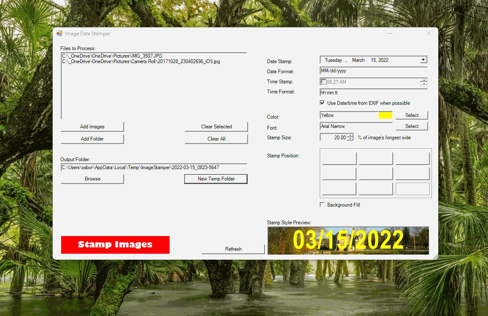

# ImageStamper

This is project I created for a job I had years ago. It has very limited utility, and there are probably free programs that do the same thing, but better. Originally written as a Visual Basic .NET WinForms app, I thought it would be fun to see if I could convert it to .NET 6.

## Purpose

The purpose of this program is to simulate burned-in date/timestamps in photos. It is designed for bulk processing, since it's relatively easy to do this manually on a one-off basis using any image editor.

Admittedly, there doesn't seem to be a lot of demand to do this. But since burned-in timestamps isn't an option in the default phone camera apps I've used, it's possible that this could come in handy for someone.

It's currently a Windows-only app that doesn't support that many image types. I'm first going to upgrade it to a .NET 6 Windows application. Then, if I feel like it, I will try to to make it cross platform, once .NET MAUI is out of preview.
